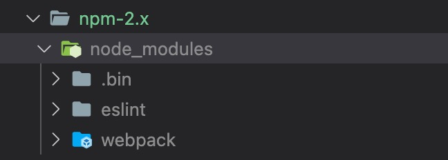
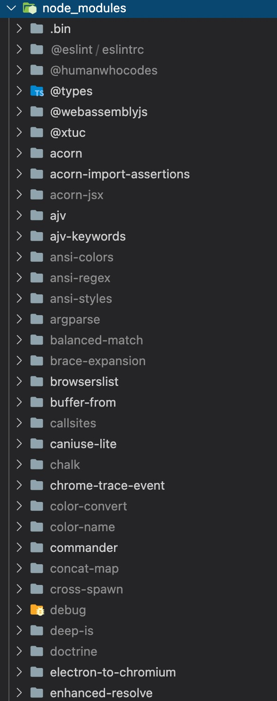
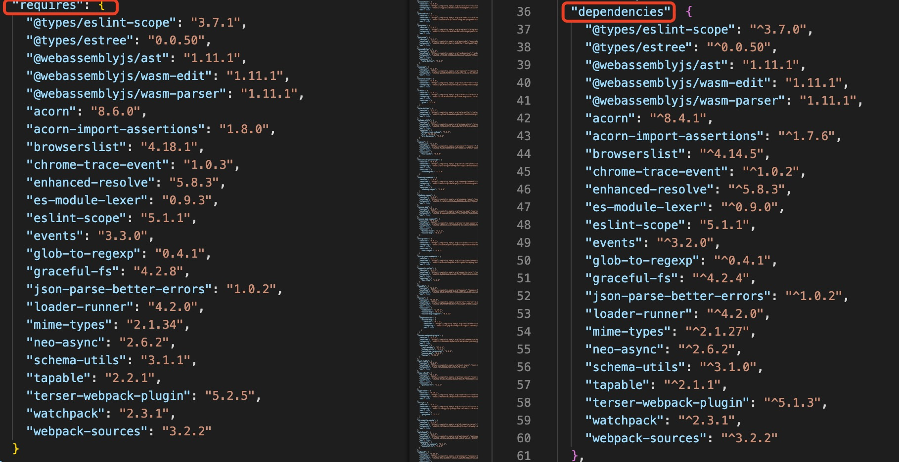

## npm

依赖包管理工具

nvm如何安装Google一下就可以。常用指令：

- 安装Node：`nvm install 4.4.1`
- 卸载Node：`nvm uninstall 4.4.1`
- 查看已安装版本：`nvm ls`
- 切换Node版本：`nvm use 8.11.1`
- 查看当前使用的Node版本：`node -v`
- 查看当前npm版本：`npm -v`

安装Node版本管理工具nvm，在nvm安装：

```javascript
Node.js v4.4.1 - npm v2.14.20
Node.js v5.4.0 - npm v3.3.12

Node.js v7.2.1 - npm v3.10.10  ----

Node.js v8.11.1 - npm v5.6.0
Node.js v10.24.1 - npm v6.14.12
Node.js v15.5.1 - npm v7.3.0
Node.js v16.13.1 - npm v8.1.2
```

## npm2

1. `npm init -yes`: 初始化项目声明文件package.json
2. `npm install webpack --save`: `install`可简写为`i`，安装项目依赖webpack，若未指定版本号，则默认安装当前最新版本。安装时会有一些WARN，但是也安装成功了。这些WARN的主要原因是当前使用的是历史悠久的npm2来安装最新版webpack，webpack的安装对node和npm版本有一定要求，这里我主要是想看下npm2依赖包管理的相关机制，并不关心其他，能成功安装就可。

  直接执行`npm i webpack`与添加`--save`或`--save-dev`指令的区别：

   - 直接执行`npm i webpack`：安装的webpack依赖包不会被添加到package.json的dependencies中，但是本地的node_modules中会webpack包的内容(有点奇怪的一个现象是：执行完之后，终端显示安装成功，但是node_modules文件夹并没有出现，需要将项目重启一下才会出现安装完成的node_modules文件夹？？？为什么？npm2.x的机制还是跟操作系统有关系？？？)
   - 执行`npm i webpack --save`与执行`npm i webpack -S`是一样的效果，表示会把安装的依赖包及其范围版本添加到package.json的dependencies中，即：
     ```javascript
     "dependencies": {
       "webpack": "^5.65.0"
     }
     ```
   - 执行`npm i webpack --save-dev`等价于执行`npm i webpack -D`，会将安装的依赖包及其范围版本添加到package.json的devDependencies中，刚才执行了`npm i webpack -S`，接着又执行该指令会发现并没有将原先安装的依赖删除掉，需要手动删除，得到如下结果，但本地node_modules中只会安装一份：
     ```javascript
     "dependencies": {
       "webpack": "^5.65.0"
     },
     "devDependencies": {
       "webpack": "^5.65.0"
     }
     ```
3. `npm ls`：查看node_nodules依赖树：

```shell
npm-2.x@1.0.0
└─┬ webpack@5.65.0
  ├─┬ @types/eslint-scope@3.7.1
  │ └─┬ @types/eslint@8.2.1
  │   └── @types/json-schema@7.0.9
  ├── @types/estree@0.0.50
  ├─┬ @webassemblyjs/ast@1.11.1
  │ ├─┬ @webassemblyjs/helper-numbers@1.11.1
  │ │ ├── @webassemblyjs/floating-point-hex-parser@1.11.1
  │ │ ├── @webassemblyjs/helper-api-error@1.11.1
  │ │ └── @xtuc/long@4.2.2
  │ └── @webassemblyjs/helper-wasm-bytecode@1.11.1
  ├─┬ @webassemblyjs/wasm-edit@1.11.1
  │ ├── @webassemblyjs/helper-buffer@1.11.1
  │ ├── @webassemblyjs/helper-wasm-bytecode@1.11.1
  │ ├── @webassemblyjs/helper-wasm-section@1.11.1
  │ ├─┬ @webassemblyjs/wasm-gen@1.11.1
  │ │ ├─┬ @webassemblyjs/ieee754@1.11.1
  │ │ │ └── @xtuc/ieee754@1.2.0
  │ │ ├─┬ @webassemblyjs/leb128@1.11.1
  │ │ │ └── @xtuc/long@4.2.2
  │ │ └── @webassemblyjs/utf8@1.11.1
  │ ├── @webassemblyjs/wasm-opt@1.11.1
  │ └─┬ @webassemblyjs/wast-printer@1.11.1
  │   └── @xtuc/long@4.2.2
  ├─┬ @webassemblyjs/wasm-parser@1.11.1
  │ ├── @webassemblyjs/helper-api-error@1.11.1
  │ ├── @webassemblyjs/helper-wasm-bytecode@1.11.1
  │ ├─┬ @webassemblyjs/ieee754@1.11.1
  │ │ └── @xtuc/ieee754@1.2.0
  │ ├─┬ @webassemblyjs/leb128@1.11.1
  │ │ └── @xtuc/long@4.2.2
  │ └── @webassemblyjs/utf8@1.11.1
  ├── acorn@8.6.0
  ├── acorn-import-assertions@1.8.0
  ├─┬ browserslist@4.18.1
  │ ├── caniuse-lite@1.0.30001286
  │ ├── electron-to-chromium@1.4.15
  │ ├── escalade@3.1.1
  │ ├── node-releases@2.0.1
  │ └── picocolors@1.0.0
  ├── chrome-trace-event@1.0.3
  ├── enhanced-resolve@5.8.3
  ├── es-module-lexer@0.9.3
  ├─┬ eslint-scope@5.1.1
  │ ├─┬ esrecurse@4.3.0
  │ │ └── estraverse@5.3.0
  │ └── estraverse@4.3.0
  ├── events@3.3.0
  ├── glob-to-regexp@0.4.1
  ├── graceful-fs@4.2.8
  ├── json-parse-better-errors@1.0.2
  ├── loader-runner@4.2.0
  ├─┬ mime-types@2.1.34
  │ └── mime-db@1.51.0
  ├── neo-async@2.6.2
  ├─┬ schema-utils@3.1.1
  │ ├── @types/json-schema@7.0.9
  │ ├─┬ ajv@6.12.6
  │ │ ├── fast-deep-equal@3.1.3
  │ │ ├── fast-json-stable-stringify@2.1.0
  │ │ ├── json-schema-traverse@0.4.1
  │ │ └─┬ uri-js@4.4.1
  │ │   └── punycode@2.1.1
  │ └── ajv-keywords@3.5.2
  ├── tapable@2.2.1
  ├─┬ terser-webpack-plugin@5.2.5
  │ ├─┬ jest-worker@27.4.4
  │ │ ├── @types/node@16.11.12
  │ │ ├── merge-stream@2.0.0
  │ │ └─┬ supports-color@8.1.1
  │ │   └── has-flag@4.0.0
  │ ├─┬ serialize-javascript@6.0.0
  │ │ └─┬ randombytes@2.1.0
  │ │   └── safe-buffer@5.2.1
  │ ├── source-map@0.6.1
  │ └─┬ terser@5.10.0
  │   ├── commander@2.20.3
  │   ├── source-map@0.7.3
  │   └─┬ source-map-support@0.5.21
  │     ├── buffer-from@1.1.2
  │     └── source-map@0.6.1
  ├── watchpack@2.3.1
  └── webpack-sources@3.2.2
```

npm2在安装依赖的时候是递归安装的，依赖关系层层嵌套，依赖包的依赖也都在其node_modules目录中，清晰明了。

webpack依赖包的依赖中的`@types/json-schema@7.0.9`在两处有依赖，查找对应的node_modules会发现该依赖包在两处都被安装了，即进行了重复安装，并且，如果嵌套层级很深，查找路径就会非常长，长到超出了系统最长路径的限制就会有问题了。

再安装一个eslint: `npm i eslint -D`，`npm ls`查看依赖树：

```shell
npm-2.x@1.0.0
├─┬ eslint@8.4.1
│ ├── @eslint/eslintrc@1.0.5
│ ├─┬ @humanwhocodes/config-array@0.9.2
│ │ └── @humanwhocodes/object-schema@1.2.1
│ ├─┬ ajv@6.12.6
│ │ ├── fast-json-stable-stringify@2.1.0
│ │ ├── json-schema-traverse@0.4.1
│ │ └─┬ uri-js@4.4.1
│ │   └── punycode@2.1.1
│ ├─┬ chalk@4.1.2
│ │ ├─┬ ansi-styles@4.3.0
│ │ │ └─┬ color-convert@2.0.1
│ │ │   └── color-name@1.1.4
│ │ └─┬ supports-color@7.2.0
│ │   └── has-flag@4.0.0
│ ├─┬ cross-spawn@7.0.3
│ │ ├── path-key@3.1.1
│ │ ├─┬ shebang-command@2.0.0
│ │ │ └── shebang-regex@3.0.0
│ │ └─┬ which@2.0.2
│ │   └── isexe@2.0.0
│ ├─┬ debug@4.3.3
│ │ └── ms@2.1.2
│ ├── doctrine@3.0.0
│ ├─┬ enquirer@2.3.6
│ │ └── ansi-colors@4.1.1
│ ├── escape-string-regexp@4.0.0
│ ├─┬ eslint-scope@7.1.0
│ │ ├── esrecurse@4.3.0
│ │ └── estraverse@5.3.0
│ ├─┬ eslint-utils@3.0.0
│ │ └── eslint-visitor-keys@2.1.0
│ ├── eslint-visitor-keys@3.1.0
│ ├─┬ espree@9.2.0
│ │ ├── acorn@8.6.0
│ │ └── acorn-jsx@5.3.2
│ ├─┬ esquery@1.4.0
│ │ └── estraverse@5.3.0
│ ├── esutils@2.0.3
│ ├── fast-deep-equal@3.1.3
│ ├─┬ file-entry-cache@6.0.1
│ │ └─┬ flat-cache@3.0.4
│ │   ├── flatted@3.2.4
│ │   └─┬ rimraf@3.0.2
│ │     └─┬ glob@7.2.0
│ │       ├── fs.realpath@1.0.0
│ │       ├─┬ inflight@1.0.6
│ │       │ └── wrappy@1.0.2
│ │       ├── inherits@2.0.4
│ │       ├─┬ once@1.4.0
│ │       │ └── wrappy@1.0.2
│ │       └── path-is-absolute@1.0.1
│ ├── functional-red-black-tree@1.0.1
│ ├── glob-parent@6.0.2
│ ├─┬ globals@13.12.0
│ │ └── type-fest@0.20.2
│ ├── ignore@4.0.6
│ ├─┬ import-fresh@3.3.0
│ │ ├─┬ parent-module@1.0.1
│ │ │ └── callsites@3.1.0
│ │ └── resolve-from@4.0.0
│ ├── imurmurhash@0.1.4
│ ├─┬ is-glob@4.0.3
│ │ └── is-extglob@2.1.1
│ ├─┬ js-yaml@4.1.0
│ │ └── argparse@2.0.1
│ ├── json-stable-stringify-without-jsonify@1.0.1
│ ├─┬ levn@0.4.1
│ │ ├── prelude-ls@1.2.1
│ │ └── type-check@0.4.0
│ ├── lodash.merge@4.6.2
│ ├─┬ minimatch@3.0.4
│ │ └─┬ brace-expansion@1.1.11
│ │   ├── balanced-match@1.0.2
│ │   └── concat-map@0.0.1
│ ├── natural-compare@1.4.0
│ ├─┬ optionator@0.9.1
│ │ ├── deep-is@0.1.4
│ │ ├── fast-levenshtein@2.0.6
│ │ ├── prelude-ls@1.2.1
│ │ ├── type-check@0.4.0
│ │ └── word-wrap@1.2.3
│ ├── progress@2.0.3
│ ├── regexpp@3.2.0
│ ├─┬ semver@7.3.5
│ │ └─┬ lru-cache@6.0.0
│ │   └── yallist@4.0.0
│ ├─┬ strip-ansi@6.0.1
│ │ └── ansi-regex@5.0.1
│ ├── strip-json-comments@3.1.1
│ ├── text-table@0.2.0
│ └── v8-compile-cache@2.3.0
└─┬ webpack@5.65.0
  ├─┬ @types/eslint-scope@3.7.1
  │ └─┬ @types/eslint@8.2.1
  │   └── @types/json-schema@7.0.9
  ├── @types/estree@0.0.50
  ├─┬ @webassemblyjs/ast@1.11.1
  │ ├─┬ @webassemblyjs/helper-numbers@1.11.1
  │ │ ├── @webassemblyjs/floating-point-hex-parser@1.11.1
  │ │ ├── @webassemblyjs/helper-api-error@1.11.1
  │ │ └── @xtuc/long@4.2.2
  │ └── @webassemblyjs/helper-wasm-bytecode@1.11.1
  ├─┬ @webassemblyjs/wasm-edit@1.11.1
  │ ├── @webassemblyjs/helper-buffer@1.11.1
  │ ├── @webassemblyjs/helper-wasm-bytecode@1.11.1
  │ ├── @webassemblyjs/helper-wasm-section@1.11.1
  │ ├─┬ @webassemblyjs/wasm-gen@1.11.1
  │ │ ├─┬ @webassemblyjs/ieee754@1.11.1
  │ │ │ └── @xtuc/ieee754@1.2.0
  │ │ ├─┬ @webassemblyjs/leb128@1.11.1
  │ │ │ └── @xtuc/long@4.2.2
  │ │ └── @webassemblyjs/utf8@1.11.1
  │ ├── @webassemblyjs/wasm-opt@1.11.1
  │ └─┬ @webassemblyjs/wast-printer@1.11.1
  │   └── @xtuc/long@4.2.2
  ├─┬ @webassemblyjs/wasm-parser@1.11.1
  │ ├── @webassemblyjs/helper-api-error@1.11.1
  │ ├── @webassemblyjs/helper-wasm-bytecode@1.11.1
  │ ├─┬ @webassemblyjs/ieee754@1.11.1
  │ │ └── @xtuc/ieee754@1.2.0
  │ ├─┬ @webassemblyjs/leb128@1.11.1
  │ │ └── @xtuc/long@4.2.2
  │ └── @webassemblyjs/utf8@1.11.1
  ├── acorn@8.6.0
  ├── acorn-import-assertions@1.8.0
  ├─┬ browserslist@4.18.1
  │ ├── caniuse-lite@1.0.30001286
  │ ├── electron-to-chromium@1.4.15
  │ ├── escalade@3.1.1
  │ ├── node-releases@2.0.1
  │ └── picocolors@1.0.0
  ├── chrome-trace-event@1.0.3
  ├── enhanced-resolve@5.8.3
  ├── es-module-lexer@0.9.3
  ├─┬ eslint-scope@5.1.1
  │ ├─┬ esrecurse@4.3.0
  │ │ └── estraverse@5.3.0
  │ └── estraverse@4.3.0
  ├── events@3.3.0
  ├── glob-to-regexp@0.4.1
  ├── graceful-fs@4.2.8
  ├── json-parse-better-errors@1.0.2
  ├── loader-runner@4.2.0
  ├─┬ mime-types@2.1.34
  │ └── mime-db@1.51.0
  ├── neo-async@2.6.2
  ├─┬ schema-utils@3.1.1
  │ ├── @types/json-schema@7.0.9
  │ ├─┬ ajv@6.12.6
  │ │ ├── fast-deep-equal@3.1.3
  │ │ ├── fast-json-stable-stringify@2.1.0
  │ │ ├── json-schema-traverse@0.4.1
  │ │ └─┬ uri-js@4.4.1
  │ │   └── punycode@2.1.1
  │ └── ajv-keywords@3.5.2
  ├── tapable@2.2.1
  ├─┬ terser-webpack-plugin@5.2.5
  │ ├─┬ jest-worker@27.4.4
  │ │ ├── @types/node@16.11.12
  │ │ ├── merge-stream@2.0.0
  │ │ └─┬ supports-color@8.1.1
  │ │   └── has-flag@4.0.0
  │ ├─┬ serialize-javascript@6.0.0
  │ │ └─┬ randombytes@2.1.0
  │ │   └── safe-buffer@5.2.1
  │ ├── source-map@0.6.1
  │ └─┬ terser@5.10.0
  │   ├── commander@2.20.3
  │   ├── source-map@0.7.3
  │   └─┬ source-map-support@0.5.21
  │     ├── buffer-from@1.1.2
  │     └── source-map@0.6.1
  ├── watchpack@2.3.1
  └── webpack-sources@3.2.2
```

太长了，简化一下：

```shell
npm-2.x@1.0.0
├─┬ eslint@8.4.1
│ ├─┬ eslint-scope@7.1.0  ⭕️
│   ├── esrecurse@4.3.0
│   └── estraverse@5.3.0
└─┬ webpack@5.65.0
  ├─┬ @types/eslint-scope@3.7.1  ⭕️
  │ └─┬ @types/eslint@8.2.1
  │   └── @types/json-schema@7.0.9  ！！！
  ├─┬ eslint-scope@5.1.1  ⭕️
  │ ├─┬ esrecurse@4.3.0
  │ │ └── estraverse@5.3.0
  │ └── estraverse@4.3.0
  ├─┬ schema-utils@3.1.1
    ├── @types/json-schema@7.0.9   ！！！
```

## npm3

> Node v5.4.1 (npm v3.3.12)

与npm2小结执行相同的步骤，初始化package.json文件并安装webpack和eslint两个依赖，查看依赖树。但是，`npm i webpack -D`后就不行了：

```javascript
npm ERR! Darwin 20.5.0
npm ERR! argv "/Users/liumengge/.nvm/versions/node/v5.4.1/bin/node" "/Users/liumengge/.nvm/versions/node/v5.4.1/bin/npm" "install" "webpack" "--save-dev"
npm ERR! node v5.4.1
npm ERR! npm  v3.3.12
npm ERR! code EMISSINGARG

npm ERR! typeerror Error: Missing required argument #1
npm ERR! typeerror     at andLogAndFinish (/Users/liumengge/.nvm/versions/node/v5.4.1/lib/node_modules/npm/lib/fetch-package-metadata.js:31:3)
npm ERR! typeerror     at fetchPackageMetadata (/Users/liumengge/.nvm/versions/node/v5.4.1/lib/node_modules/npm/lib/fetch-package-metadata.js:51:22)
npm ERR! typeerror     at resolveWithNewModule (/Users/liumengge/.nvm/versions/node/v5.4.1/lib/node_modules/npm/lib/install/deps.js:445:12)
npm ERR! typeerror     at /Users/liumengge/.nvm/versions/node/v5.4.1/lib/node_modules/npm/lib/install/deps.js:446:7
npm ERR! typeerror     at /Users/liumengge/.nvm/versions/node/v5.4.1/lib/node_modules/npm/node_modules/iferr/index.js:13:50
npm ERR! typeerror     at /Users/liumengge/.nvm/versions/node/v5.4.1/lib/node_modules/npm/lib/fetch-package-metadata.js:37:12
npm ERR! typeerror     at addRequestedAndFinish (/Users/liumengge/.nvm/versions/node/v5.4.1/lib/node_modules/npm/lib/fetch-package-metadata.js:82:5)
npm ERR! typeerror     at returnAndAddMetadata (/Users/liumengge/.nvm/versions/node/v5.4.1/lib/node_modules/npm/lib/fetch-package-metadata.js:117:7)
npm ERR! typeerror     at pickVersionFromRegistryDocument (/Users/liumengge/.nvm/versions/node/v5.4.1/lib/node_modules/npm/lib/fetch-package-metadata.js:134:20)
npm ERR! typeerror     at /Users/liumengge/.nvm/versions/node/v5.4.1/lib/node_modules/npm/node_modules/iferr/index.js:13:50
npm ERR! typeerror This is an error with npm itself. Please report this error at:
npm ERR! typeerror     <http://github.com/npm/npm/issues>
npm WARN engine tapable@2.2.1: wanted: {"node":">=6"} (current: {"node":"5.4.1","npm":"3.3.12"})

npm ERR! Please include the following file with any support request:
npm ERR!     /Users/liumengge/Desktop/frontEnder-Milly/前端工程化/npm-version/npm-3.x/npm-debug.log
```

解决方法：使用淘宝镜像源`sudo npm install cnpm --registry=https://registry.npm.taobao.org`，也可以加`-g`指令全局安装。经过漫长的安装过程后，使用`cnpm i webpack -D`再尝试一次, 安装非常非常慢，有时间再次尝试，这里升级了node版本为`v7.2.1`对应的npm版本为`v 3.10.10`可以正常安装。


安装完成之后同样没有直接获取到node_modules目录，重启项目之后查看node_modules目录发现与npm2不同的是，node_modules下的依赖包被扁平化处理了。

## npm5

`nvm use 8.11.1`切换到npm v5.6.0。

`npm init -y`初始化，`npm i webpack -D`安装依赖webpack，这里就会发现与npm2.x和npm3.x存在的明显不同是同时生成了一个node_modules目录和一个package-lock.json文件(这里安装完就有node_modules目录，不必像npm2.x一样需要重启项目)

```
npm-5.x@1.0.0
└─┬ webpack@5.65.0
  ├─┬ @types/eslint-scope@3.7.1
  │ ├─┬ @types/eslint@8.2.1
  │ │ ├── @types/estree@0.0.50 deduped
  │ │ └── @types/json-schema@7.0.9 deduped
  │ └── @types/estree@0.0.50 deduped
  ├── @types/estree@0.0.50
  ├─┬ @webassemblyjs/ast@1.11.1
  │ ├─┬ @webassemblyjs/helper-numbers@1.11.1
  │ │ ├── @webassemblyjs/floating-point-hex-parser@1.11.1
  │ │ ├── @webassemblyjs/helper-api-error@1.11.1 deduped
  │ │ └── @xtuc/long@4.2.2
  │ └── @webassemblyjs/helper-wasm-bytecode@1.11.1
  ├─┬ @webassemblyjs/wasm-edit@1.11.1
  │ ├── @webassemblyjs/ast@1.11.1 deduped
  │ ├── @webassemblyjs/helper-buffer@1.11.1
  │ ├── @webassemblyjs/helper-wasm-bytecode@1.11.1 deduped
  │ ├─┬ @webassemblyjs/helper-wasm-section@1.11.1
  │ │ ├── @webassemblyjs/ast@1.11.1 deduped
  │ │ ├── @webassemblyjs/helper-buffer@1.11.1 deduped
  │ │ ├── @webassemblyjs/helper-wasm-bytecode@1.11.1 deduped
  │ │ └── @webassemblyjs/wasm-gen@1.11.1 deduped
  │ ├─┬ @webassemblyjs/wasm-gen@1.11.1
  │ │ ├── @webassemblyjs/ast@1.11.1 deduped
  │ │ ├── @webassemblyjs/helper-wasm-bytecode@1.11.1 deduped
  │ │ ├── @webassemblyjs/ieee754@1.11.1 deduped
  │ │ ├── @webassemblyjs/leb128@1.11.1 deduped
  │ │ └── @webassemblyjs/utf8@1.11.1 deduped
  │ ├─┬ @webassemblyjs/wasm-opt@1.11.1
  │ │ ├── @webassemblyjs/ast@1.11.1 deduped
  │ │ ├── @webassemblyjs/helper-buffer@1.11.1 deduped
  │ │ ├── @webassemblyjs/wasm-gen@1.11.1 deduped
  │ │ └── @webassemblyjs/wasm-parser@1.11.1 deduped
  │ ├── @webassemblyjs/wasm-parser@1.11.1 deduped
  │ └─┬ @webassemblyjs/wast-printer@1.11.1
  │   ├── @webassemblyjs/ast@1.11.1 deduped
  │   └── @xtuc/long@4.2.2 deduped
  ├─┬ @webassemblyjs/wasm-parser@1.11.1
  │ ├── @webassemblyjs/ast@1.11.1 deduped
  │ ├── @webassemblyjs/helper-api-error@1.11.1
  │ ├── @webassemblyjs/helper-wasm-bytecode@1.11.1 deduped
  │ ├─┬ @webassemblyjs/ieee754@1.11.1
  │ │ └── @xtuc/ieee754@1.2.0
  │ ├─┬ @webassemblyjs/leb128@1.11.1
  │ │ └── @xtuc/long@4.2.2 deduped
  │ └── @webassemblyjs/utf8@1.11.1
  ├── acorn@8.6.0
  ├── acorn-import-assertions@1.8.0
  ├─┬ browserslist@4.18.1
  │ ├── caniuse-lite@1.0.30001286
  │ ├── electron-to-chromium@1.4.15
  │ ├── escalade@3.1.1
  │ ├── node-releases@2.0.1
  │ └── picocolors@1.0.0
  ├── chrome-trace-event@1.0.3
  ├─┬ enhanced-resolve@5.8.3
  │ ├── graceful-fs@4.2.8 deduped
  │ └── tapable@2.2.1 deduped
  ├── es-module-lexer@0.9.3
  ├─┬ eslint-scope@5.1.1
  │ ├─┬ esrecurse@4.3.0
  │ │ └── estraverse@5.3.0
  │ └── estraverse@4.3.0
  ├── events@3.3.0
  ├── glob-to-regexp@0.4.1
  ├── graceful-fs@4.2.8
  ├── json-parse-better-errors@1.0.2
  ├── loader-runner@4.2.0
  ├─┬ mime-types@2.1.34
  │ └── mime-db@1.51.0
  ├── neo-async@2.6.2
  ├─┬ schema-utils@3.1.1
  │ ├── @types/json-schema@7.0.9
  │ ├─┬ ajv@6.12.6
  │ │ ├── fast-deep-equal@3.1.3
  │ │ ├── fast-json-stable-stringify@2.1.0
  │ │ ├── json-schema-traverse@0.4.1
  │ │ └─┬ uri-js@4.4.1
  │ │   └── punycode@2.1.1
  │ └── ajv-keywords@3.5.2
  ├── tapable@2.2.1
  ├─┬ terser-webpack-plugin@5.2.5
  │ ├─┬ jest-worker@27.4.4
  │ │ ├── @types/node@16.11.12
  │ │ ├── merge-stream@2.0.0
  │ │ └─┬ supports-color@8.1.1
  │ │   └── has-flag@4.0.0
  │ ├── schema-utils@3.1.1 deduped
  │ ├─┬ serialize-javascript@6.0.0
  │ │ └─┬ randombytes@2.1.0
  │ │   └── safe-buffer@5.2.1
  │ ├── source-map@0.6.1
  │ └─┬ terser@5.10.0
  │   ├── commander@2.20.3
  │   ├── source-map@0.7.3
  │   └─┬ source-map-support@0.5.21
  │     ├── buffer-from@1.1.2
  │     └── source-map@0.6.1 deduped
  ├─┬ watchpack@2.3.1
  │ ├── glob-to-regexp@0.4.1 deduped
  │ └── graceful-fs@4.2.8 deduped
  └── webpack-sources@3.2.2
```

npm ls查看的就是嵌套形式的依赖树？ npm5在终端打印的依赖树结构与npm2是一致的？？？如何查看当前node_modules安装包的结构？？？

看下node_modules目录吧





可以看到，使用npm5生成的node_modules目录结构与npm3是一致的，与npm3不同的是，npm5生成的项目中还自动生成了package-lock.json文件，先看下具体的文件结构：

```json
{
  "name": "npm-5.x",
  "version": "1.0.0",
  "lockfileVersion": 1,
  "requires": true,
  "dependencies": {
    "@eslint/eslintrc": {}
  }
}
```
package-lock.json的作用是锁定依赖安装结构，会发现与node_modules目录的文件层级结构是一一对应的。

打开package-lock.json会发现文件内容很长，但是json文件中的字段都是重复的，主要就包含了以下几个字段：

- version：依赖包的确切版本号
- resolved：依赖包的安装源
- integrity：依赖包的内容hash
- dependencies：与依赖包中node_modules目录中依赖的包一致
- requires：最外层的requires为true，dependencies中依赖包的requires属性值与node_modules中对应包的package.json文件中dependencies一致，比如：

  
  从图中可以看出，唯一的区别就是package-lock.json的requires指定的是确切版本，而node_modules中对应依赖包的package.json/文件中dependencies指定的是范围版本。

所以，package-lock.json其实就是node_modules的描述文件，package-lock.json中能明确看得出依赖包的依赖关系，而node_modules则是扁平化的依赖包存储。

## npm6

> 目前团队项目中统一应用Node v10.24.1 (npm v6.14.12)


## npm8

> 当前最新Node稳定版本：Node.js v16.13.1 - npm v8.1.2

